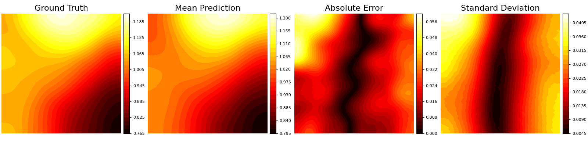

# Arbitrarily-Conditioned-Multi-Functional-Diffusion-for-Multi-Physics-Emulation

### Darcy Flow

**task: f, u to a**  

**task: a, u to f**  

**task: a, f to u**  

**task: u to a**  

**task: u to f**  

