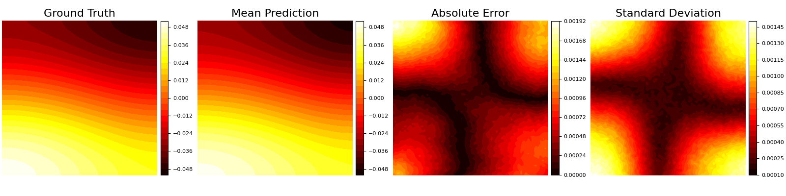
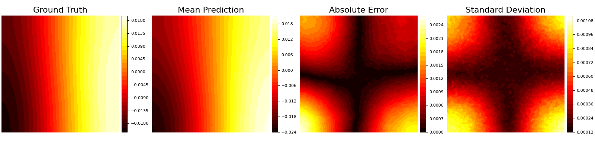
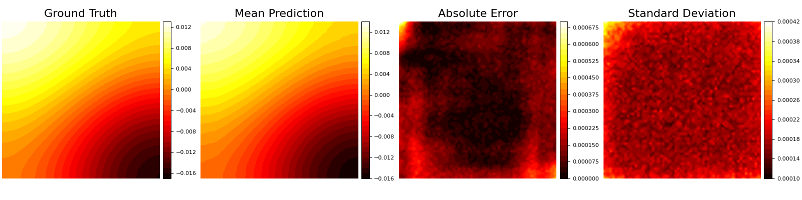
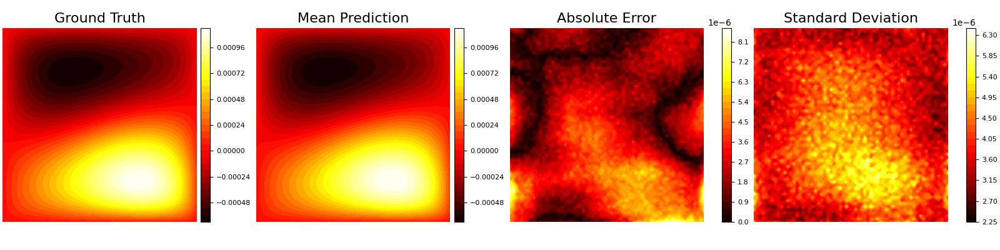
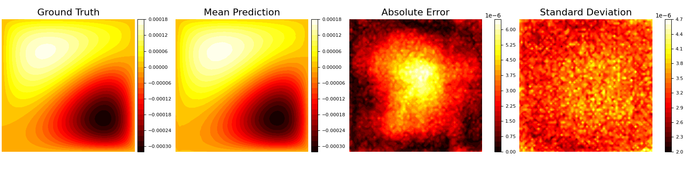
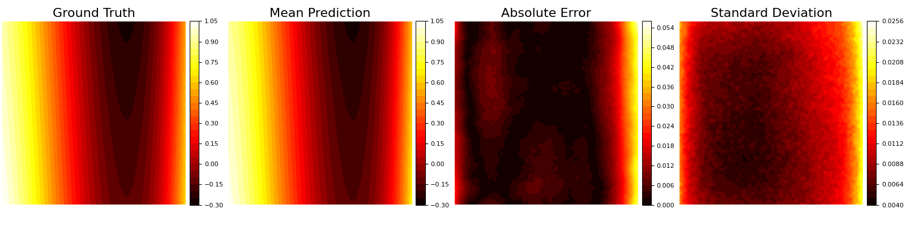
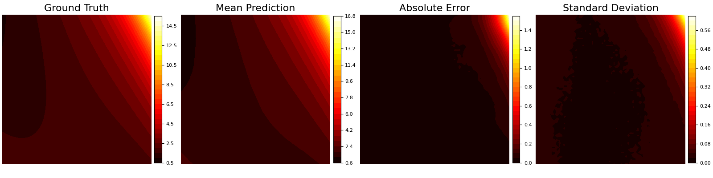
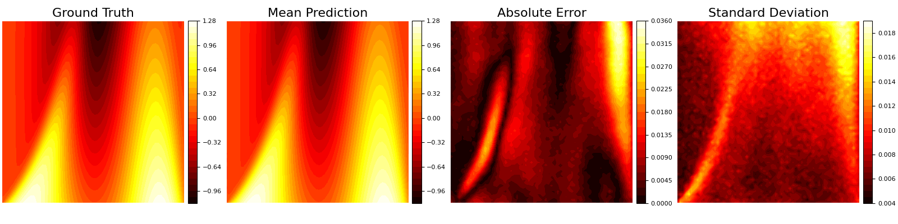
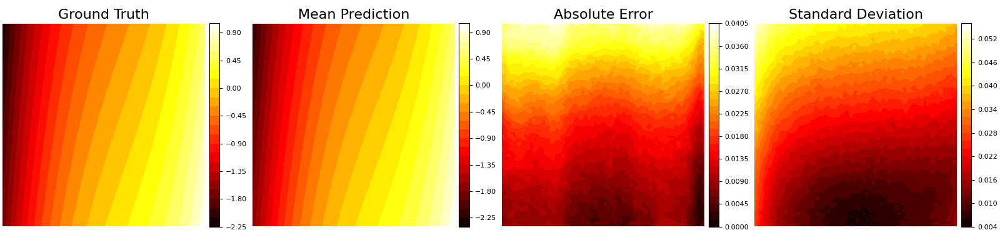
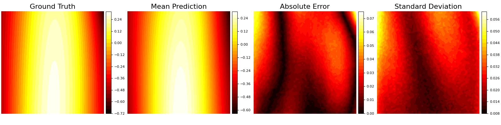

# Arbitrarily-Conditioned-Multi-Functional-Diffusion-for-Multi-Physics-Emulation

## Darcy Flow

**Task: u to f**  

**Task: a, u to f**  

**Task: a, f to u**  

## Convection Diffusion

**Task: s, u to v**  

**Task: v, u to s**  

**Task: v, s to u**  

**Task: u to v**  

**Task: u to s**  

